# API de Produtos

## Estrutura de camadas

1. **Controller**: camada responsável por definir os endpoints da aplicação e também por conter parte das anotações utilizadas na documentação via Swagger.
1. **Model**: agrupa as entidades da aplicação, que representam a estrutura das tabelas no banco de dados.
1. **Repository**: interfaces que realizam a comunicação direta com o banco de dados, geralmente por meio do Spring Data JPA.
1. **Service**: concentra a lógica de negócio da aplicação, incluindo validações e chamadas para o repositório.
1. **Exception**:  contém as classes de exceções personalizadas utilizadas para tratamento de erros na API.

## Diagrama de Classes Simples

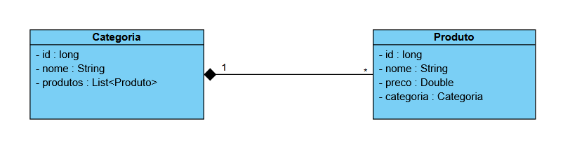

## Prints do Swagger

### Categorias

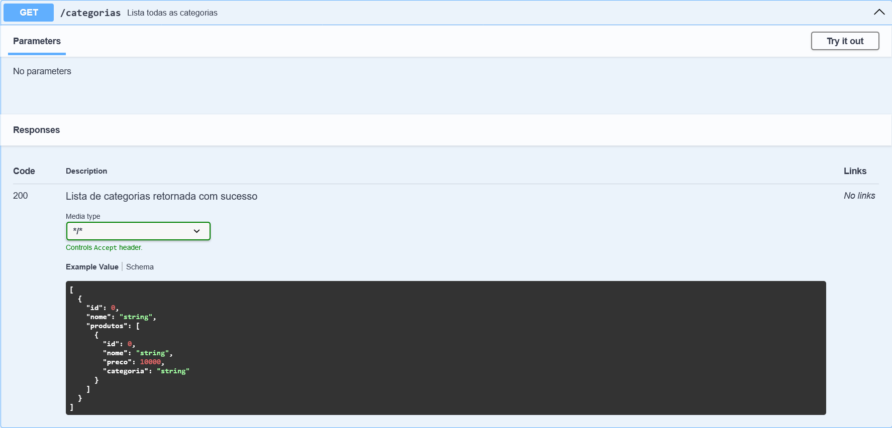
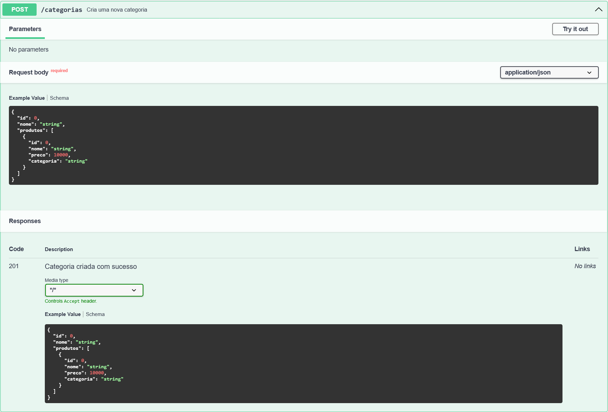
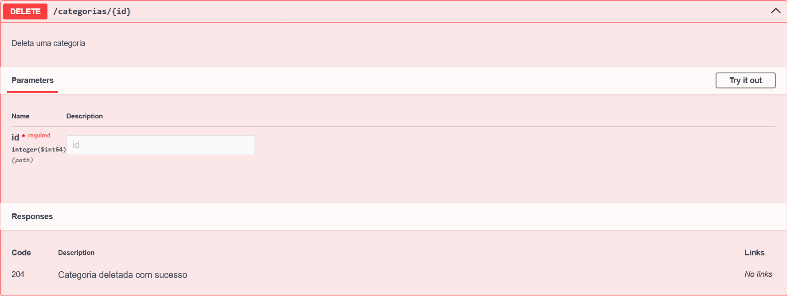
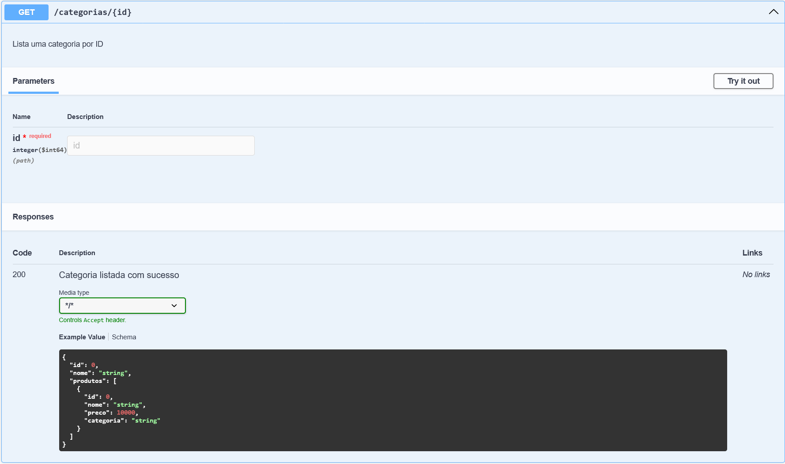
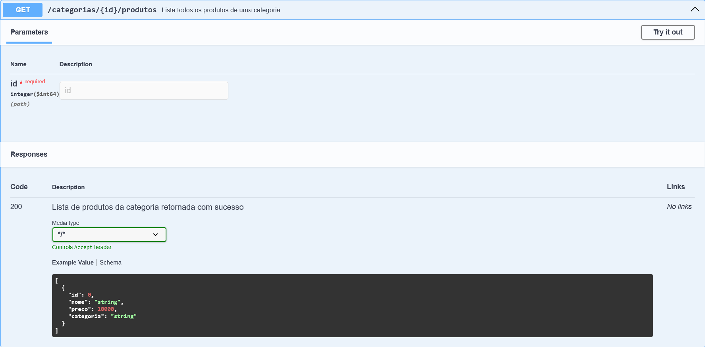

### Produtos

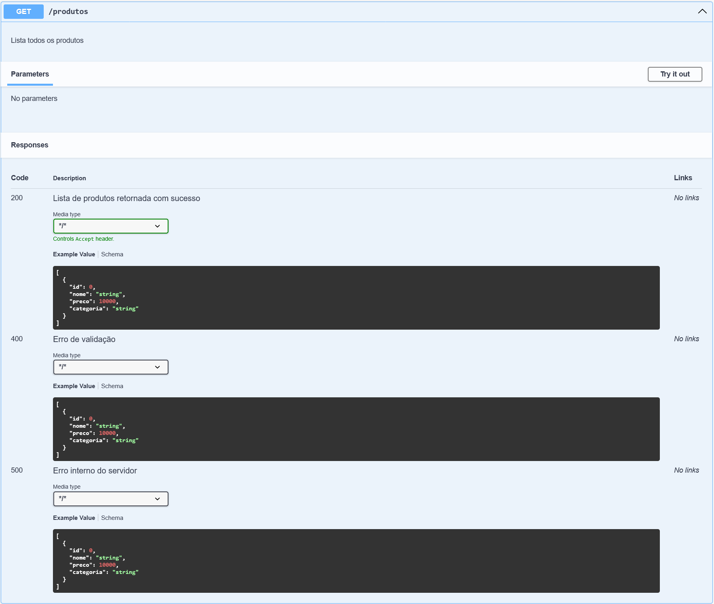
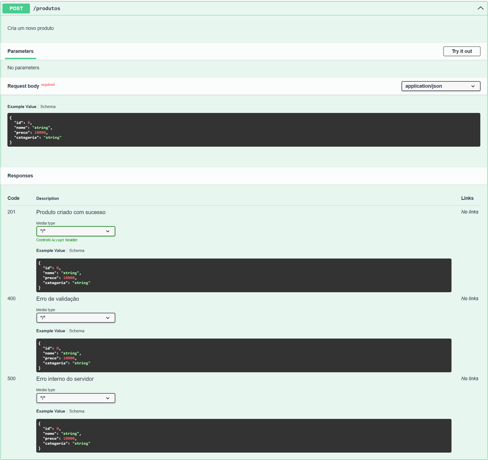
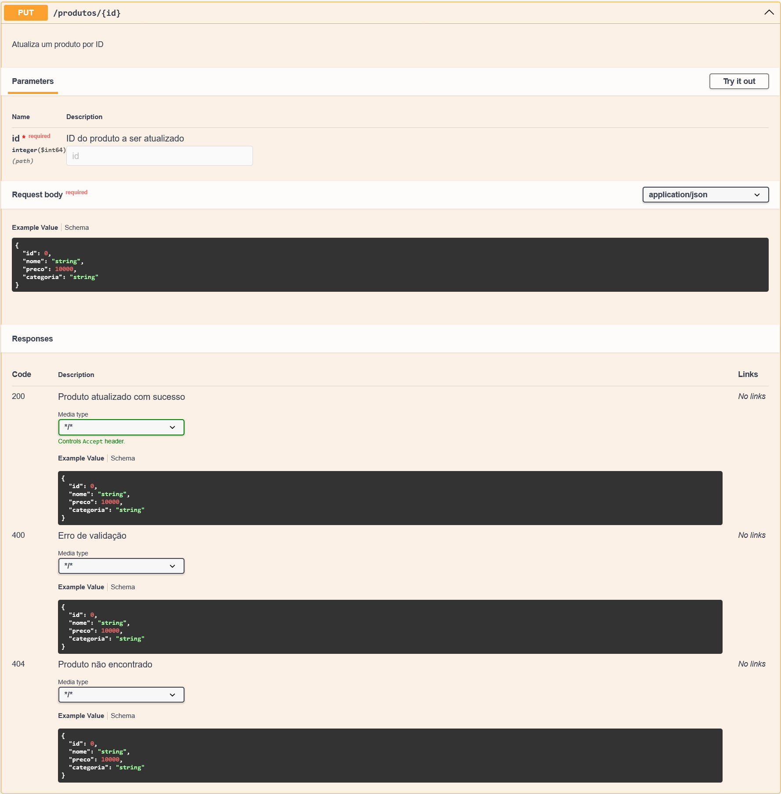
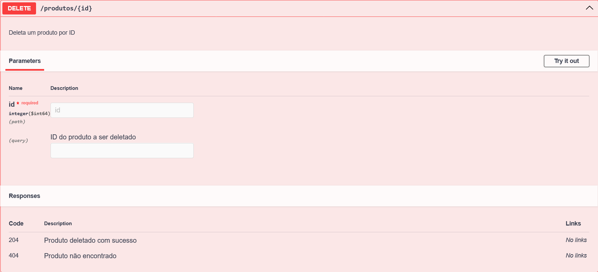
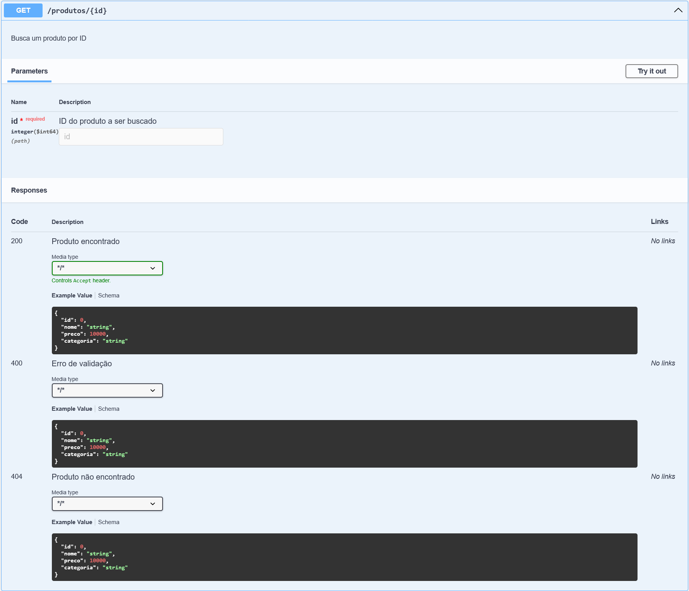
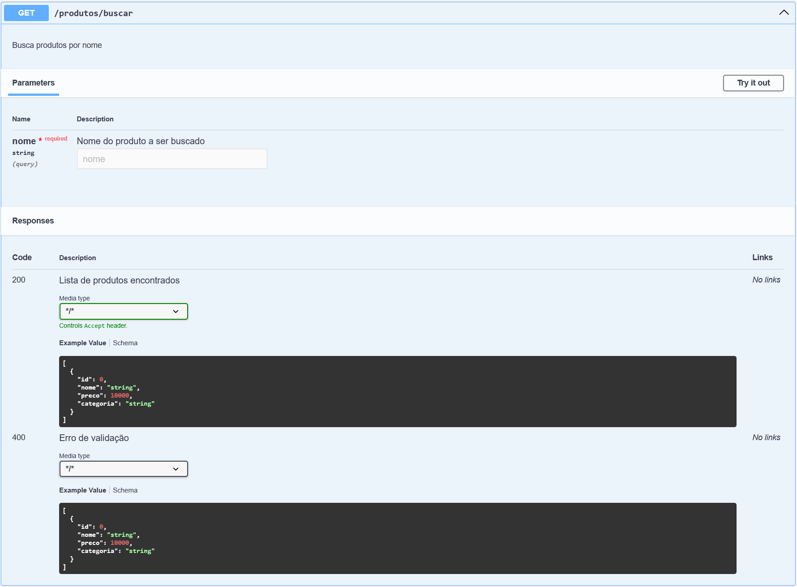
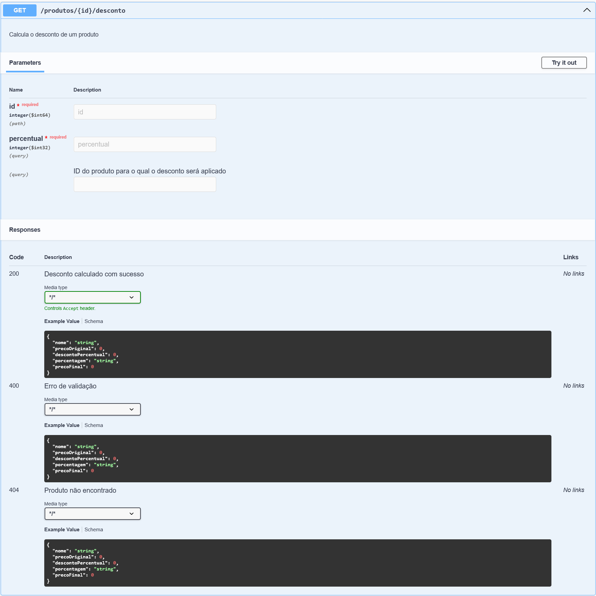

## Regras de Negócio Implementadas

- Nome não pode ser duplicado.
- Preço ≤ R$ 10.000,00.
- Se o nome conter “Promoção”, preço < R$ 500,00.
- Não permitir atualização se o ID não existir.
- A busca deve ser contendo o texto informado (case insensitive).
- Se nada for encontrado, retornar lista vazia (não lançar erro).
- Não permitir descontos maiores que 50%.
- Não permitir salvar produto sem categoria.
- A categoria deve ser escolhida por ID no momento do cadastro ou atualização do produto.